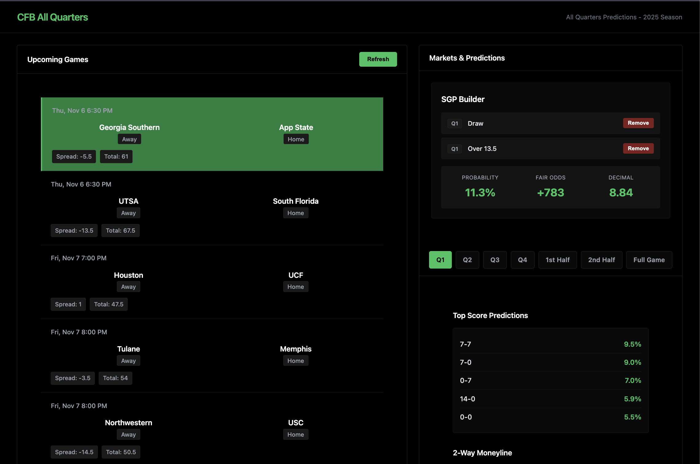
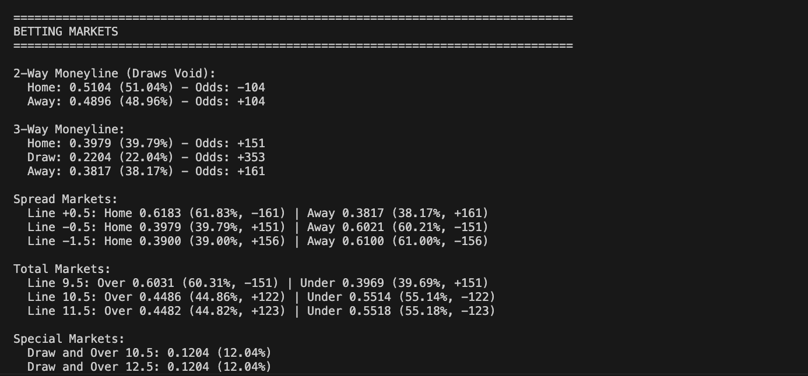
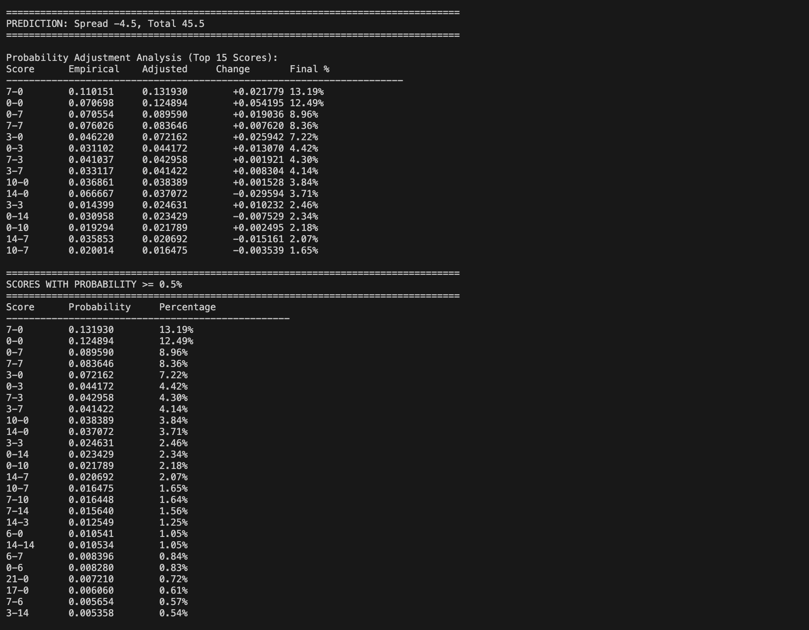
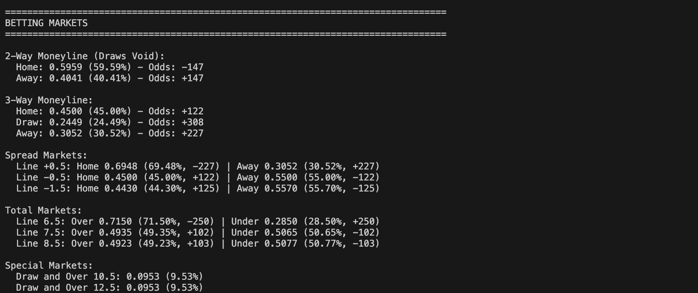

Two Examples showing the discrepancies in pricing for Q1 Draw and Over Total. Essentially betting on the landing rates of 7-7, 10-10, 14-14 are too low in draftkings pricing. 

Game 1 Kansas st @ Arizona, Sep 12, 2025. 
Lines: Kansas St -1.5 and total 54.5

Model Output

Fanduel Output 

EV Calculation for American odds of +503 given our models 12% chance = -27.6% EV 

Draftkings Output

EV Calculation for American odds of +1100 given our models 12% chance = 44% EV 

Game 2 Colorado @ Houston, Sep 12, 2025. 
Lines: Houston -4.5 and total4 45.5 

Model Output 

Fanduel Output

** We are assuming price of Draw and Over 9.5 == Draw and Over 10.5 as only combination different is 5-5 which probability is negligible
EV Calculation for American odds of +693 given our models 9.5% probability = -25% EV 

Draftkings Output

EV Calculation for American odds of +1800 given our models 9.5% probability = 80% EV