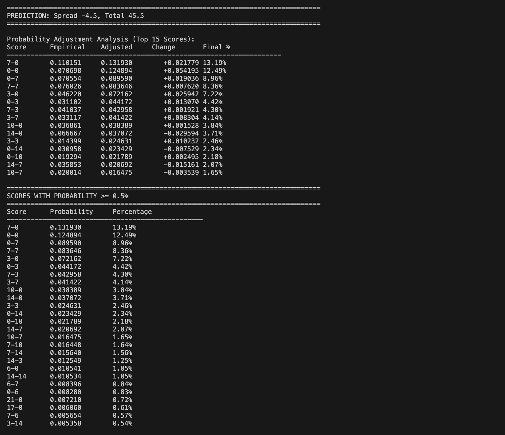

Two Examples showing the discrepancies in pricing for Q1 Draw and Over Total. Essentially betting on the landing rates of 7-7, 10-10, 14-14 are too low in draftkings pricing. 

Georgia Southern @ App State, Nov 6, 2025. 
Lines: App State -5.5 and total 61

Model Output

Fanduel Output 

EV Calculation for American odds of +421 given our models 11.3% chance = -41% EV 

Draftkings Output

EV Calculation for American odds of +1400 given our models 11.3% chance = 70% EV 
Empirically 7-7 appears ~8% of the time so a game with a high total and pretty even matchup should be higher then this so even without a model you can tell
that DK's offer of 0.067 makes no sense. 
